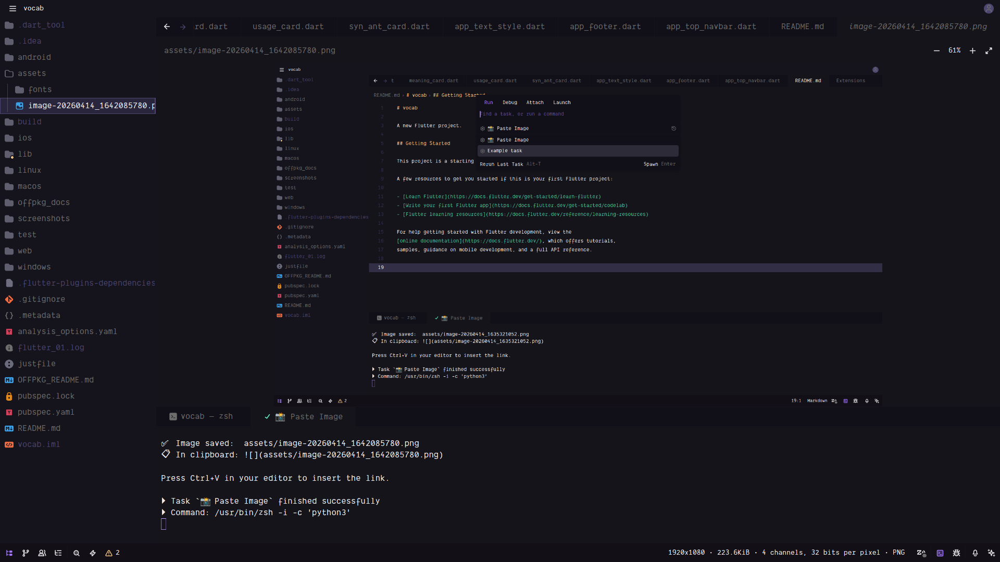
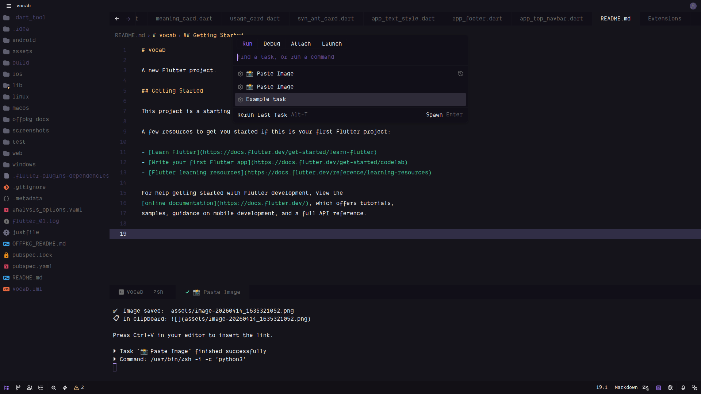
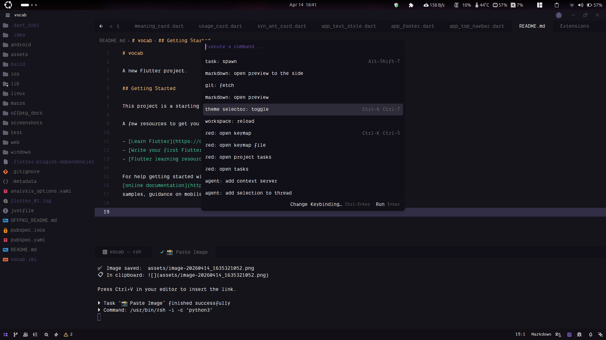

# Zed File Drop 󰋩


A **cross-platform** Zed extension and task that lets you paste files, folders, and images directly from your clipboard or file manager into the editor, generating the relevant Markdown links — just like VS Code.

[](https://zed.dev)
[](#)
[](https://python.org)
[](LICENSE)

---

## How it Works

1. **Copy** any image — a screenshot, or an image copied from Nautilus/Thunar/Files.
2. **Press** `Ctrl+Shift+P` → run `󰋩 Paste File/Image`, or use a custom hotkey.
3. The script saves the item to `assets/` in your workspace.
4. The resulting Markdown link `` or `[file](assets/...)` is placed in your clipboard automatically.
5. **Press** `Ctrl+V` in your editor to insert the link.

> This works for **both screenshot images AND files copied from your file manager**.



---


## Installation

### Step 1 — Install a clipboard tool for your platform

**Linux (Wayland — recommended):**
```bash
sudo apt install wl-clipboard
```

**Linux (X11):**
```bash
sudo apt install xclip
```

**macOS / Windows:**
```bash
pip install Pillow
```

### Step 2 — Install the dev extension in Zed

1. Open Zed.
2. Open the Command Palette: `Ctrl+Shift+P`
3. Run: **`zed: install dev extension`**
4. Select the `zed-file-drop/` directory.

The extension registers a **Slash Command** (`/paste-image`) in the AI Assistant panel automatically.

### Step 3 — (Recommended) Global Task Setup

To make image pasting available in **all** your projects without copying files:

1. Open `~/.config/zed/tasks.json`.
2. Add the following task:

```json
[
  {
    "label": "󰋩 Paste File/Image",
    "command": "python3",
    "args": [
      "/home/aswin/programming/vscode/myProjects/zed-file-drop/scripts/paste_to_editor.py",
      "${ZED_WORKTREE_ROOT}"
    ],
    "use_new_terminal": false,
    "allow_concurrent_runs": false,
    "reveal": "always"
  }
]
```


---

## Usage

### Option A — Task Picker (works immediately)

1. Open **any** project in Zed.
2. Press `Ctrl+Shift+P` → type **`task: spawn`** → select **󰋩 Paste File/Image**.



3. Tiny terminal pops up: Image is saved to `assets/` and the link is copied.
4. Press `Ctrl+V` to paste the link into your file.




### Option B — Custom Hotkey (recommended for daily use)

Add this to your Zed keymap (`Ctrl+Shift+P` → `zed: open keymap`):

```json
[
  {
    "context": "Workspace",
    "bindings": {
      "ctrl+shift+v": ["task::Spawn", { "task_name": "󰋩 Paste File/Image" }]
    }
  }
]
```

Now `Ctrl+Shift+V` → saves image → `Ctrl+V` → done.

---

## Developer: Fast Updates

If you are modifying the code or adding features, use the provided update script to rebuild and sync the extension to Zed instantly:

```bash
# Rebuilds WASM and syncs all files to Zed's installed-extensions dir
bash update.sh
```

---


## Project Structure

```
zed-file-drop/
├── Cargo.toml                  # WASM extension build config
├── extension.toml              # Zed slash command registration
├── src/lib.rs                  # Extension core (for /paste-image in Agent panel)
├── scripts/
│   └── paste_to_editor.py      # ← Main script: reads clipboard, saves image
├── update.sh                   # ← Automation script for devs
├── .zed/
│   └── tasks.json              # Task definition (project-specific)
└── docs/                       # Full documentation

    ├── guide.md
    ├── architecture.md
    ├── code_explanation.md
    ├── features.md
    └── modifications.md
```

---

## Why not just use Ctrl+V directly?

Zed's extension API does not currently allow extensions to intercept keypress events in the editor buffer. This is a platform-level limitation, not a bug we can fix. The Task + clipboard approach is the closest possible equivalent.

---

## Documentation

| Doc | Description |
|---|---|
| [Guide](docs/guide.md) | Full setup and usage examples |
| [Architecture](docs/architecture.md) | WASM sandbox, sidecar pattern |
| [Code Explanation](docs/code_explanation.md) | Rust + Python walkthrough |
| [Features](docs/features.md) | What's implemented and why |
| [Modifications](docs/modifications.md) | Change history and bug fixes |
