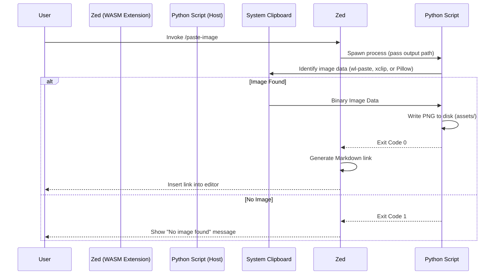

# Architecture

This document describes the technical architecture of the `zed-file-drop` extension.

## Overview

Zed editor extensions run in a **WASM (WebAssembly) sandbox** (using the `wasm32-wasip1` target). For security and portability, this sandbox restricts direct access to many host system resources, most notably the **system clipboard**.

Standard Rust crates like `arboard` cannot compile to this target as they depend on native OS C-bindings or platform-specific APIs.

## The Sidecar Pattern

To overcome the sandbox limitations, this extension implements a **Sidecar Pattern**.

1.  **Host Execution**: The logic that requires system permissions (reading the clipboard) is moved to a Rust sidecar binary (`zed-file-drop-sidecar`) that runs natively on the host machine.
2.  **Child Processes**: The Zed Extension API provides a `process::Command` utility that allows the WASM extension to execute binaries available on the host's `$PATH`.
3.  **Alternative Python Script**: A Python script (`scripts/paste_to_editor.py`) is also available for direct execution via Zed Tasks.

### Workflow Diagram

## Data Handling

- **Formats**: The extension currently forces conversion to **PNG** for consistency and compatibility with Markdown previewers.
- **Storage**: Images are stored in an `assets/` folder relative to the **Workspace Root**.
- **Naming**: Filenames are generated using a millisecond-precision timestamp (`image-1713073000000.png`) to prevent collisions.

## Technical Stack

- **Extension Core**: Rust (compiled to `wasm32-wasip1`).
- **API**: `zed_extension_api` (v0.7.0).
- **Sidecar**: Python 3.
- **Clipboard Drivers**: 
  - Linux (Wayland): `wl-clipboard`
  - Linux (X11): `xclip`
  - macOS/Windows: Python `Pillow` library.
## Configuration & Deployment

### Global Task Configuration
While the extension provides a `/paste-image` slash command for use in the Assistant panel, editor-buffer insertion is handled via a **Zed Task**. 
- **Path**: `~/.config/zed/tasks.json`
- **Method**: Spawns the sidecar script using an absolute path to the project scripts.
- **Variable substitution**: Uses `${ZED_WORKTREE_ROOT}` to ensure images are saved relative to the currently active project in the editor.

### Build & Sync Automation
For development, the `update.sh` script automates the bridge between the development project and Zed's internal extension storage (`~/.local/share/zed/extensions/installed/`). This ensures that changes to both the Rust WASM core and the Python sidecar are reflected instantly across all open Zed instances.
